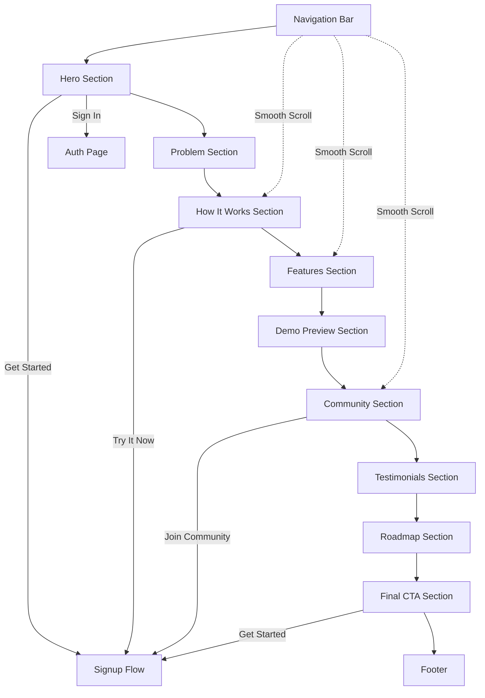

# Design Document: Sparkle.AI Landing Page

## Overview

The Sparkle.AI landing page is a single-page marketing website built with modern web technologies. It will be implemented as a responsive, accessible, and performant web application that converts visitors into users through compelling storytelling and clear calls-to-action. The design follows a vertical scroll narrative structure with 11 distinct sections, each serving a specific purpose in the user journey from awareness to conversion.

### Technology Stack

- **Frontend Framework**: React 18+ with TypeScript
- **Styling**: Tailwind CSS for utility-first styling with custom configuration
- **Animations**: Framer Motion for smooth transitions and scroll-based animations
- **Icons**: Lucide React for consistent iconography
- **Fonts**: Google Fonts (Playfair Display, custom Grotesk alternative like Inter or DM Sans)
- **Build Tool**: Vite for fast development and optimized production builds
- **Deployment**: Static site hosting (Vercel, Netlify, or similar)

### Design Principles

1. **Visual Hierarchy**: Use typography scale and color contrast to guide attention
2. **Progressive Disclosure**: Reveal information as users scroll, maintaining engagement
3. **Consistency**: Maintain uniform spacing, colors, and component patterns
4. **Performance**: Lazy load images and animations, optimize bundle size
5. **Accessibility**: WCAG 2.1 AA compliance with semantic HTML and ARIA labels

## Architecture

### Component Structure

```
src/
├── components/
│   ├── layout/
│   │   ├── Navigation.tsx          # Sticky header with nav links
│   │   └── Footer.tsx              # Footer with links and social icons
│   ├── sections/
│   │   ├── HeroSection.tsx         # Main hero with tagline and CTAs
│   │   ├── ProblemSection.tsx      # Why personalized learning matters
│   │   ├── HowItWorksSection.tsx   # 3-step process explanation
│   │   ├── FeaturesSection.tsx     # 4 feature cards
│   │   ├── DemoSection.tsx         # Interactive demo preview
│   │   ├── CommunitySection.tsx    # Community learning explanation
│   │   ├── TestimonialsSection.tsx # User quotes and social proof
│   │   ├── RoadmapSection.tsx      # Current scope and future vision
│   │   └── FinalCTASection.tsx     # Final conversion section
│   ├── ui/
│   │   ├── Button.tsx              # Reusable button component
│   │   ├── Card.tsx                # Feature and content cards
│   │   ├── GridBackground.tsx      # Reusable grid pattern background
│   │   └── GlowEffect.tsx          # Hover glow effect wrapper
│   └── icons/
│       └── SparkleIcon.tsx         # Custom sparkle decorative icons
├── hooks/
│   ├── useScrollAnimation.ts       # Custom hook for scroll-triggered animations
│   └── useSmoothScroll.ts          # Smooth scroll navigation
├── styles/
│   └── globals.css                 # Global styles and Tailwind imports
├── utils/
│   └── constants.ts                # Color palette, typography, spacing constants
└── App.tsx                         # Main application component
```

### Page Flow



## Components and Interfaces

### 1. Navigation Component

**Purpose**: Provide persistent navigation and quick access to key sections and CTAs

**Props Interface**:
```typescript
interface NavigationProps {
  transparent?: boolean; // For hero section overlay
  onCTAClick: () => void;
  onSignInClick: () => void;
}
```

**State Management**:
- `isScrolled`: Boolean to track if user has scrolled (changes background opacity)
- `isMobileMenuOpen`: Boolean for mobile hamburger menu state
- `activeSection`: String tracking current section for active link highlighting

**Behavior**:
- Fixed positioning with `position: fixed; top: 0; z-index: 50`
- Background transitions from transparent to white with blur on scroll
- Smooth scroll to sections when nav links clicked
- Collapses to hamburger menu below 768px breakpoint
- Logo click scrolls to top

**Styling**:
- Height: 80px desktop, 64px mobile
- Padding: 24px horizontal
- Background: `rgba(255, 255, 255, 0.9)` with `backdrop-filter: blur(10px)` when scrolled
- Logo: Grotesk Bold, 24px, with neon lime sparkle icon
- Links: Grotesk Medium, 16px, #000000, hover with glow effect
- CTA Button: Primary style with glow effect

### 2. Hero Section Component

**Purpose**: Capture attention and communicate core value proposition immediately

**Props Interface**:
```typescript
interface HeroSectionProps {
  onGetStarted: () => void;
  onSignIn: () => void;
}
```

**Layout**:
- Full viewport height (100vh)
- Centered content with max-width 1200px
- Grid background covering entire section
- Floating decorative icons (sparkles, abstract shapes) with subtle animation

**Content Structure**:
```
<GridBackground>
  <FloatingIcons />
  <Content>
    <Tagline>Learn in Your Own Style</Tagline>
    <Subtext>Tell us your learning style — visuals, examples, or deep explanations...</Subtext>
    <CTAGroup>
      <PrimaryButton>Get Started</PrimaryButton>
      <SecondaryButton>Sign In</SecondaryButton>
    </CTAGroup>
  </Content>
</GridBackground>
```

**Animations**:
- Tagline: Fade in + slide up (0.6s delay)
- Subtext: Fade in + slide up (0.8s delay)
- Buttons: Fade in + slide up (1s delay)
- Floating icons: Continuous subtle float animation (3-5s duration, infinite)

**Typography**:
- Tagline: Playfair Display Italic, 72px (desktop) / 48px (mobile), -0.02em letter-spacing
- Subtext: Grotesk Regular, 20px (desktop) / 16px (mobile), 1.5 line-height
- Buttons: Grotesk Medium, 18px

### 3. Problem Section Component

**Purpose**: Establish pain point and position Sparkle AI as the solution

**Layout**:
- Two-column layout (desktop): 50% text, 50% illustration
- Single column (mobile): Text stacked above illustration
- Padding: 120px vertical, 80px horizontal (desktop)
- Background: #F3F3F3

**Content**:
- Headline: "Learning isn't one-size-fits-all. But most tools treat it that way."
- Body text explaining the problem
- Illustration: SVG showing contrast between frustrated learner (traditional) vs happy learner (Sparkle)

**Styling**:
- Headline: Playfair Display Italic, 48px, #000000
- Body: Grotesk Regular, 18px, #333333, 1.6 line-height
- Illustration: Max-width 500px, centered in column

### 4. How It Works Section Component

**Purpose**: Explain the user journey in three simple, digestible steps

**Props Interface**:
```typescript
interface Step {
  icon: string;
  title: string;
  description: string;
  emoji: string;
}

interface HowItWorksSectionProps {
  steps: Step[];
  onCTAClick: () => void;
}
```

**Layout**:
- Horizontal 3-card layout (desktop)
- Vertical stacked cards (mobile)
- Cards have equal width with spacing between
- Padding: 120px vertical

**Card Structure**:
```typescript
<StepCard>
  <IconCircle>{emoji}</IconCircle>
  <StepNumber>Step {index}</StepNumber>
  <Title>{title}</Title>
  <Description>{description}</Description>
</StepCard>
```

**Styling**:
- Card: White background, rounded-2xl, padding 40px, subtle shadow
- Icon Circle: 80px diameter, #B2FF00 background, centered emoji
- Title: Grotesk Bold, 24px, #000000
- Description: Grotesk Regular, 16px, #666666
- Hover: Lift effect (translateY -8px) + enhanced shadow + glow border

**Animation**:
- Cards fade in and slide up sequentially as they enter viewport
- Stagger delay: 0.2s between each card

### 5. Features Section Component

**Purpose**: Highlight four key differentiators of Sparkle AI

**Props Interface**:
```typescript
interface Feature {
  icon: ReactNode;
  title: string;
  description: string;
}

interface FeaturesSectionProps {
  features: Feature[];
}
```

**Layout**:
- 2x2 grid (desktop)
- Single column (mobile)
- Gap: 32px between cards
- Padding: 120px vertical
- Background: White

**Feature Card Structure**:
```typescript
<FeatureCard>
  <IconWrapper>{icon}</IconWrapper>
  <Title>{title}</Title>
  <Description>{description}</Description>
</FeatureCard>
```

**Styling**:
- Card: #F3F3F3 background, rounded-xl, padding 32px
- Icon: 48px size, #B2FF00 color
- Title: Grotesk Bold, 22px, #000000
- Description: Grotesk Regular, 16px, #666666, 1.5 line-height
- Hover: Glow border effect + slight scale (1.02)

### 6. Demo Section Component

**Purpose**: Provide concrete visualization of the platform in action

**State Management**:
- `currentSlide`: Number tracking which demo view is displayed (0-2)
- `isAutoPlaying`: Boolean for automatic carousel progression

**Layout**:
- Centered content with max-width 1000px
- Mockup display area with navigation dots below
- Padding: 120px vertical
- Background: #F3F3F3

**Demo Views**:
1. Input prompt mockup
2. Generated milestones list
3. SVG visualization sample

**Mockup Styling**:
- Container: White background, rounded-lg, shadow-2xl
- Browser chrome: Fake address bar and window controls
- Content area: Padding 40px, min-height 500px
- Navigation dots: 12px circles, #CCCCCC inactive, #B2FF00 active

**Interactions**:
- Click dots to navigate between views
- Swipe gestures on mobile
- Auto-advance every 5 seconds (pausable on hover)

### 7. Community Section Component

**Purpose**: Showcase collaborative learning and user-generated content

**Layout**:
- Text content centered at top
- Grid of sample content cards below (3 columns desktop, 1 mobile)
- Padding: 120px vertical
- Background: White

**Content Card Structure**:
```typescript
<CommunityCard>
  <Thumbnail>{placeholder image}</Thumbnail>
  <Tags>
    <Tag>Loops</Tag>
    <Tag>Python</Tag>
  </Tags>
  <Title>Understanding For Loops</Title>
  <Author>By @username</Author>
</CommunityCard>
```

**Styling**:
- Card: White background, rounded-lg, border 1px #E5E5E5, hover shadow
- Thumbnail: 16:9 aspect ratio, #F3F3F3 background with centered icon
- Tags: Inline, rounded-full, #B2FF00 background, 12px text
- Title: Grotesk Medium, 16px, #000000
- Author: Grotesk Regular, 14px, #999999

### 8. Testimonials Section Component

**Purpose**: Build trust through social proof

**Props Interface**:
```typescript
interface Testimonial {
  quote: string;
  author: string;
  role?: string;
}

interface TestimonialsSectionProps {
  testimonials: Testimonial[];
}
```

**Layout**:
- 3-column grid (desktop), single column (mobile)
- Cards with equal height
- Padding: 100px vertical
- Background: #F3F3F3

**Card Styling**:
- White background, rounded-xl, padding 32px
- Quote: Grotesk Regular, 18px, #333333, italic
- Author: Grotesk Medium, 16px, #000000
- Role: Grotesk Regular, 14px, #666666
- Decorative quote marks in #B2FF00

### 9. Roadmap Section Component

**Purpose**: Set expectations and build excitement for future features

**Layout**:
- Centered content, max-width 800px
- Timeline-style visual (optional)
- Padding: 120px vertical
- Background: White

**Content Structure**:
- Headline
- Current focus paragraph with highlighted keywords
- Future vision paragraph
- Optional: Visual timeline or roadmap graphic

**Styling**:
- Headline: Playfair Display Italic, 48px
- Body: Grotesk Regular, 18px, 1.6 line-height
- Highlighted terms: #B2FF00 background, padding 2px 8px, rounded

### 10. Final CTA Section Component

**Purpose**: Convert convinced visitors with strong call-to-action

**Props Interface**:
```typescript
interface FinalCTASectionProps {
  onGetStarted: () => void;
}
```

**Layout**:
- Centered content
- Large headline
- Prominent CTA button
- Subtext below button
- Padding: 160px vertical
- Background: Gradient from #F3F3F3 to white

**Styling**:
- Headline: Playfair Display Italic, 56px, centered
- Button: Extra large (padding 20px 60px), 20px text, enhanced glow
- Subtext: Grotesk Regular, 16px, #666666

**Animation**:
- Pulse effect on button (subtle scale 1.0 to 1.05, 2s infinite)

### 11. Footer Component

**Purpose**: Provide secondary navigation and legal/social links

**Layout**:
- Three-column layout (desktop): Logo/tagline, Links, Social icons
- Stacked layout (mobile)
- Padding: 60px vertical, 80px horizontal
- Background: #000000 with grid pattern overlay

**Content Structure**:
```
<Footer>
  <Column>
    <Logo />
    <Tagline>AI that learns how you learn</Tagline>
  </Column>
  <Column>
    <LinkGroup>
      <Link>About</Link>
      <Link>Blog</Link>
      <Link>Careers</Link>
      <Link>Privacy Policy</Link>
      <Link>Terms</Link>
    </LinkGroup>
  </Column>
  <Column>
    <SocialIcons>
      <Icon>Discord</Icon>
      <Icon>Twitter</Icon>
      <Icon>GitHub</Icon>
      <Icon>Email</Icon>
    </SocialIcons>
  </Column>
</Footer>
```

**Styling**:
- Text color: #FFFFFF
- Links: Grotesk Regular, 14px, hover with #B2FF00 glow
- Social icons: 24px, hover scale 1.1 + glow
- Grid background: Subtle, low opacity

## Data Models

### Navigation Link Model
```typescript
interface NavLink {
  label: string;
  href: string; // Section ID for smooth scroll
  external?: boolean;
}
```

### Feature Model
```typescript
interface Feature {
  id: string;
  icon: string; // Lucide icon name
  title: string;
  description: string;
}
```

### Step Model
```typescript
interface Step {
  id: number;
  emoji: string;
  title: string;
  description: string;
}
```

### Testimonial Model
```typescript
interface Testimonial {
  id: string;
  quote: string;
  author: string;
  role?: string;
}
```

### Community Content Model
```typescript
interface CommunityContent {
  id: string;
  title: string;
  author: string;
  tags: string[];
  thumbnailUrl?: string;
}
```

## Error Handling

### Image Loading Failures
- Use placeholder backgrounds (#F3F3F3) with centered icon
- Implement lazy loading with intersection observer
- Provide alt text for all images

### Navigation Errors
- Gracefully handle missing section IDs
- Fallback to top of page if section not found
- Log errors to console in development

### Animation Performance
- Use `will-change` CSS property sparingly
- Disable animations on low-performance devices (prefers-reduced-motion)
- Implement intersection observer to only animate visible elements

### Responsive Breakpoints
- Mobile: < 768px
- Tablet: 768px - 1024px
- Desktop: > 1024px
- Wide: > 1440px

## Testing Strategy

### Unit Testing
- Test individual components in isolation
- Mock props and callbacks
- Verify correct rendering of content
- Test responsive behavior with different viewport sizes

**Key Test Cases**:
- Navigation: Smooth scroll functionality, mobile menu toggle
- Buttons: Click handlers, hover states, accessibility
- Cards: Hover effects, content rendering
- Forms: Input validation (if applicable)

### Integration Testing
- Test section-to-section navigation flow
- Verify CTA buttons navigate correctly
- Test scroll-triggered animations
- Verify responsive layout changes

### Accessibility Testing
- Keyboard navigation through all interactive elements
- Screen reader compatibility (ARIA labels)
- Color contrast ratios (WCAG AA)
- Focus indicators on all interactive elements

### Performance Testing
- Lighthouse score targets:
  - Performance: > 90
  - Accessibility: 100
  - Best Practices: > 90
  - SEO: > 90
- First Contentful Paint: < 1.5s
- Time to Interactive: < 3.0s
- Cumulative Layout Shift: < 0.1

### Browser Testing
- Chrome (latest 2 versions)
- Firefox (latest 2 versions)
- Safari (latest 2 versions)
- Edge (latest version)
- Mobile Safari (iOS 14+)
- Chrome Mobile (Android 10+)

### Visual Regression Testing
- Capture screenshots of each section
- Compare against baseline on code changes
- Test across different viewport sizes

## Design Decisions and Rationales

### Single Page Application
**Decision**: Implement as SPA with smooth scrolling sections rather than multi-page site
**Rationale**: Creates cohesive narrative flow, reduces load times, enables smooth animations between sections, better for conversion optimization

### Tailwind CSS
**Decision**: Use Tailwind for styling instead of CSS-in-JS or traditional CSS
**Rationale**: Faster development, smaller bundle size, built-in responsive utilities, easy to maintain consistency, excellent purging for production

### Framer Motion
**Decision**: Use Framer Motion for animations
**Rationale**: Declarative API, excellent performance, built-in scroll animations, gesture support, TypeScript support

### Component-Based Architecture
**Decision**: Break page into reusable section components
**Rationale**: Easier testing, better maintainability, enables future page variations, clear separation of concerns

### Lazy Loading
**Decision**: Implement intersection observer for animations and image loading
**Rationale**: Improves initial load performance, reduces unnecessary rendering, better mobile experience

### Mobile-First Responsive Design
**Decision**: Design mobile layouts first, then enhance for larger screens
**Rationale**: Majority of traffic is mobile, forces focus on essential content, easier to scale up than down

### Accessibility First
**Decision**: Build with semantic HTML and ARIA labels from the start
**Rationale**: Inclusive design, better SEO, legal compliance, improved usability for all users

### Static Site Generation
**Decision**: Deploy as static site rather than server-rendered
**Rationale**: Better performance, lower hosting costs, improved security, easier scaling, works with CDN

This design provides a comprehensive blueprint for implementing the Sparkle.AI landing page with modern web technologies, clear component boundaries, and a focus on performance and user experience.
